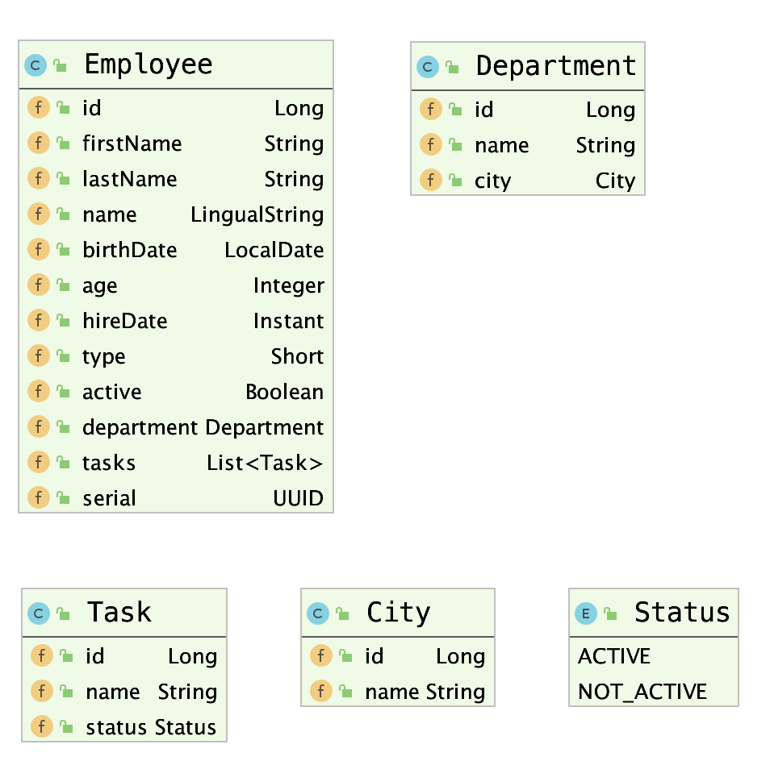

= Query Specifications

include::include.adoc[]

****
From its name, **Spring Data JPA MongoDB Expressions** inspired by
https://docs.mongodb.com/manual/tutorial/query-documents/[MongoDB Query Language,role=external,window=_blank]
and uses a subset of the language and converts it to Spring Data JPA Specifications under the hood.

In this section we will see by example all the supported features started by basic querying to
comparison operators to joins and other features.
****

== Overview

Before we go into details of the query language, we will go through the steps it takes to convert `JSON`-encoded
`MongoDB`-like Query to SQL query.

.High Level Operations
image::images/hld.png[High Level Overview,align=center]

The first step (yellow):: The query is created at the frontend app (Angular, React, Vue, etc...) in JSON format
according to MongoDB Query language rules and as will be shown in this section.

The second step (green):: The JSON is being deserialized into `com.github.mhewedy.expressions.Expressions` object
and thus can be passed to your Repository (the one the extends `com.github.mhewedy.expressions.ExpressionsRepository`).
+
This intermediate step allows you to add additional conditions easily on the deserialized `Expressions` object as
it is not uncommon you need to restrict the query passed from the frontend.

NOTE: You can see the <<#_public_api,Public API>> for details on how to use the `Expressions` and `Expression` objects.

The third step (red):: Where the `Expressions` object is being converted into Spring Data JPA `Specification` object
and then Spring Data JPA along with the underlying Persistence provider will take care of the rest
(including paging and sorting, etc...).

== Queries

To get an idea about the queries in this section, here's the domain that the queries will apply on:

.Sample domain model

NOTE: You might need to have a look on the <<#_operators,supported operators list>> before proceed to the next section.

=== Basic Queries
1. Basic query:
+
[source,json]
----
{
  "lastName": "ibrahim",
  "birthDate": {"$lte": "1985-10-10"}
}
----
Generated SQL:
+
[source,sql]
----
... where last_name=? and birth_date<=?
----
+
.Default Comparison and Logical Operators
****
In *MongoDB*, the default comparison operator if omitted is `_$eq_` (equals) and the default logical operator
between two expressions is `_$and_` (AND).
This is why the generated sql compares `last_name` using `$eq` operator (equals) and then use the `$and` (AND) operator between the two expressions. +
You can know more about MongoDB query language from this https://docs.mongodb.com/manual/tutorial/query-documents/[link,role=external,window=_blank].
****
+
2. Basic queries with comparison operators:
+
[source,json]
----
include::{jsondir}/testFindAllInBaseRepository.json[]
----
Generated SQL:
+
[source,sql]
----
... where last_name=? and birth_date>? and birth_date<=?
----
TIP: In case of passing a string value into a field of type `java.time` API (e.g. `LocalDate`, `Instant`, etc...),
the method `parse` on the corresponding type is responsible of convert the string into an object of that type.
+
NOTE: However the default logical operator is `$and`, in the above example we had to add it explicitly, this is because
in `JSON` you cannot have duplicated object keys (in this case would be `birthDate`).
+
3. Send search query with no conditions:
+
[source,json]
----
{}
----
Generated SQL:
+
[source,sql]
----
... where ?=1
----
NOTE: `?` in the query parameter above is bound to the value `true`
+
4. Search with `null` value (`is null` and `is not null`):
+
[source,json]
----
include::{jsondir}/testSearchByNull.json[]
----
+
[source,java]
----
// in the controller:
expressions.or(Expression.of("lastName", Operator.$ne, (String) null));
----
Generated SQL:
+
[source,sql]
----
... where first_name is null or last_name is not null
----

=== Logical operators

According to MongoDB query language, the default logical operator if omitted is the `$and` operator.
The following are examples of complex logical operators that follows operator precedence.

1. Complex case with multiple OR and AND Expressions:
+
[source,json]
----
include::{jsondir}/testComplexCaseWithMultipleOrAndExpressions.json[]
----
Generated SQL:
+
[source,sql]
----
... where last_name = ? or first_name = ? and birth_date > ?
----
2. Complex case with multiple OR and AND Expressions:
+
[source,json]
----
include::{jsondir}/testComplexCaseWithMultipleOrAndExpressions2.json[]
----
Generated SQL:
+
[source,sql]
----
... where last_name = ? and (first_name = ? or birth_date < ?)
----

=== Text Operators

1. Using Contains for search in fields:
+
[source,json]
----
include::{jsondir}/testSearchByContains.json[]
----
Generated SQL:
+
[source,sql]
----
... where last_name like ?
----
2. Using Contains ignore case for search in fields:
+
[source,json]
----
include::{jsondir}/testSearchByIgnoreCaseContains.json[]
----
Generated SQL:
+
[source,sql]
----
... where lower(last_name) like ?
----
+
3. Using contains for number fields:
+
[source,json]
----
include::{jsondir}/testNumberContains.json[]
----
Generated SQL:
+
[source,sql]
----
... from employee e where cast(e.age as varchar(255)) like ?
----

NOTE: Other text <<#_operators,operators>> are supported as well, such as `$start`, `$end`, `$istart`, `$iend`

TIP: the `i` character at the start of the text operator donates case-insensitive nature of the operator.

=== Paging and sorting

Due to being built on top of Spring Data JPA, __Spring Data JPA MongoDB Expressions__ library is fully compatible with the
Paging and Sorting features of Spring Data JPA.

1. Paging and sorting in the url:
+
[source,text]
----
/api/search?page=0&size=20&sort=id,desc
----

2. Paging and sorting in code:
+
[source,json]
----
include::{jsondir}/testPagingAndSorting.json[]
----
+
[source,java]
----
// in the controller:
Pageable pageable = PageRequest.of(0, 3, Sort.by("firstName").descending()); // or from the controller method parameters

Page<Employee> employeeList = employeeRepository.findAll(expressions, pageable);
----
Generated SQL:
+
[source,sql]
----
... where hire_date<? order by first_name desc limit ?
----

=== Joins
==== Many to one
1. **Many to one **Join:
+
[source,json]
----
include::{jsondir}/testNestingUsingManyToOneJoin.json[]
----
Generated SQL:
+
[source,sql]
----
... from employee e inner join department d on e.department_id=d.id where e.last_name=? and (d.name like ?)
----
2. Many to one Join with `IN` queries:
+
[source,json]
----
include::{jsondir}/testNestingUsingManyToOneJoinUsingInQueries.json[]
----
Generated SQL:
+
[source,sql]
----
... employee e inner join department d on e.department_id=d.id where d.name in (? , ?)
----
3. Using Many to one Join with deep nested level:
+
[source,json]
----
include::{jsondir}/testNestingUsingManyToOneJoinUsingDeepNestedLevel.json[]
----
Generated SQL:
+
[source,sql]
----
... from employee e inner join department d on e.department_id=d.id inner join city c on d.city_id=c.id where e.last_name=? and c.name=?
----
4. Many to One with multiple fields of the One association in the where condition :
+
[source,json]
----
include::{jsondir}/testNestingUsingManyToOneJoinWithMultipleFields.json[]
----
Generated SQL:
+
[source,sql]
----
... from employee e inner join department d on e.department_id=d.id where e.last_name=? and d.id=? and d.name=?
----
5. Many to one where association is `null`:
+
[source,json]
----
include::{jsondir}/testManyToOneIsNull.json[]
----
Generated SQL:
+
[source,sql]
----
... from employee e where e.department is null
----

==== One to Many
1. Using *One to Many* join:
+
[source,json]
----
include::{jsondir}/testNestingUsingOneToManyJoin.json[]
----
Generated SQL:
+
[source,sql]
----
... from employee e inner join task t on e.id=t.employee_id where t.name like ?
----
+
NOTE: The `distinct` keyword is being used in the queries to eliminate duplicates in case of `one-to-many` and `many-to-many` joins.

TIP: Sometimes the join capabilities is not enough or not the best way for the use case you trying to implement,
in such case you can create a database _view_ and map it to an JPA Entity and then build your search on it.

TIP: The returned properties are the properties of the primary Entity, which means the `projection` is not supported due to limitation in spring-data-jpa addressed in this https://github.com/mhewedy/spring-data-jpa-mongodb-expressions/issues/4[bug,role=external,window=_blank], until it is fixed and if you need to return properties from other entities involved in the join, you need to follow the database _view_ workaround mentioned in the previous tip.

==== Left and right joins
1. *Left* join could be represented by *optional chaining operator* (`?.`). +
Example on left join `department` with `city`:
+
[source,json]
----
include::{jsondir}/testLeftJoin.json[]
----
Generated SQL:
+
[source,sql]
----
...from employee e join department d on d.id = e.department_id left join city c on c.id = d.city_id where e.first_name = ? or c.name = ?
----
TIP: The `?.` operator in languages like JavaScript or Kotlin enables safe property access, directly mapping to a *left* join in SQL
by allowing property retrieval if the referenced object exists while returning `null` instead of causing an error when it doesn't.
2. Alternative notation (more toward SQL world) which support both *_left and right_* joins
is to prefix entity name by `<` for left join and `>` for right join, example on left join (department left join city):
+
[source,json]
----
include::{jsondir}/testLeftJoinAlternateSyntax.json[]
----
Generated SQL:
+
[source,sql]
----
...from employee e join department d on d.id = e.department_id left join city c on c.id = d.city_id where e.first_name = ? or c.name = ?
----
+
NOTE: `"<department.city.name"` means left join between `employee` (the current object) and `department`,
whereas `"department.<city.name"` means left join between `department` and `city`.
+
NOTE: Using *optional chaining operator* `"<department.city.name"` could be represented as `"department?.city.name"`
and `"department.<city.name"` could be represented as `"department.city?.name"`.

=== Embedded
1. Using embedded fields:
+
[source,json]
----
include::{jsondir}/testEmbeddedAndJoin.json[]
----
Generated SQL:
+
[source,sql]
----
... from employee e inner join department d on e.department_id=d.id where e.employee_name_ar=? and d.name=?
----

=== Enums
1. Passing enums as Integer ordinal:
+
[source,json]
----
include::{jsondir}/testEnumInInts.json[]
----
Generated SQL:
+
[source,sql]
----
... from employee e inner join task t on e.id=t.employee_id where t.status in (? , ?)
----
2. Passing enums as string enum names:
+
[source,json]
----
include::{jsondir}/testEnumNotInStrings.json[]
----
Generated SQL:
+
[source,sql]
----
... from employee e inner join task t on e.id=t.employee_id where t.status not in (?)
----

=== UUID

1. querying against UUID fields:
+
[source,json]
----
include::{jsondir}/testUUID.json[]
----
Generated SQL:
+
[source,sql]
----
... where e.serial=?
----

== Entity Graph
As with any query method in Spring Data JPA, expression query methods also support entity graphs, which help control how
related entities are loaded from the database. There are two types of entity graphs:

1. Fetch Graph (`jakarta.persistence.fetchgraph`)
+
This graph explicitly defines which attributes should be fetched eagerly. Any attributes not listed in the graph will be
fetched lazily—even if they are marked as EAGER in the entity definition.footnote:[Hibernate overrides this behaviour and load all EAGER attributes.]
+
[source,java]
----
@EntityGraph(attributePaths = {"name", "age"}, type = EntityGraphType.FETCH)
List<Employee> findAll(Expressions expressions);
----
2. Load Graph (`jakarta.persistence.loadgraph`)
+

This graph defines attributes that should be eagerly fetched in addition to those already marked as EAGER.
Attributes not listed in the graph still follow their default fetch type.
+
[source,java]
----
@EntityGraph(attributePaths = {"department", "tasks"}, type = EntityGraphType.LOAD)
List<Employee> findAll(Expressions expressions);
----

== Operators

The following is the list of supported operators:

.Operators List
[frame=all, grid=all,stripes=even]
|===
|Operator      | Description

|`$eq`      | col = val   (if val is null then => col is null)
|`$ne`     |  col <> val  (if val is null then => col is not null)
|`$ieq`    |  lower(col) = lower(val)
|`$gt`     |  col > val
|`$gte`    |  col >= val
|`$lt`     |  col < val
|`$lte`    |  col <= val
|`$start`  |  col like 'val%'
|`$end`     |  col like '%val'
|`$contains`|  col like '%val%'
|`$istart`  |  lower(col) like 'lower(val)%'
|`$iend`    |  lower(col) like '%lower(val)'
|`$icontains`|  lower(col) like '%lower(val)%'
|`$in`      |  col in (val1, val2, ...)
|`$nin`     |  col not in (val1, val2, ...)
|`$or`      |  expr1 or expr2
|`$and`     |  expr1 and expr2
|===

